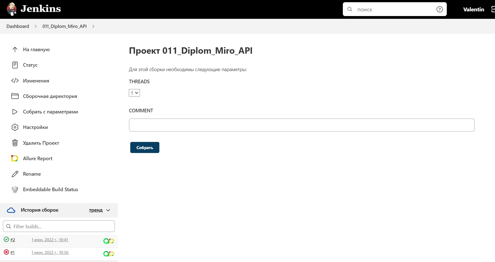
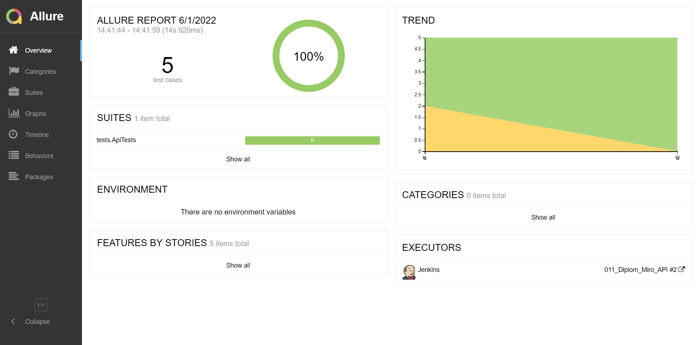
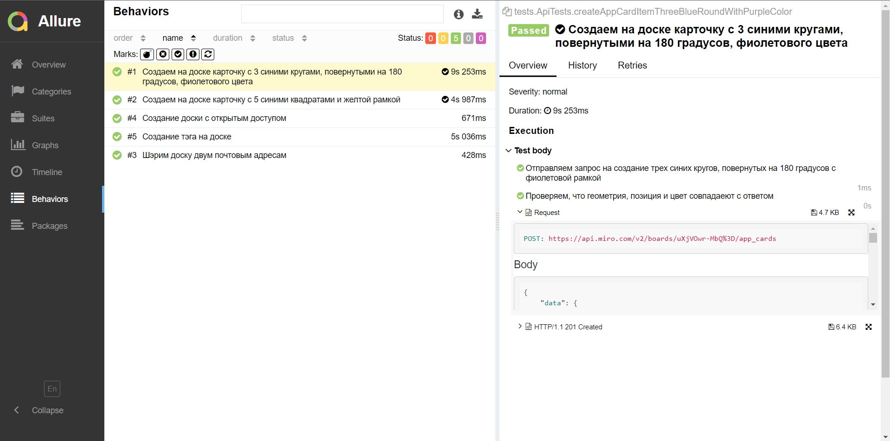
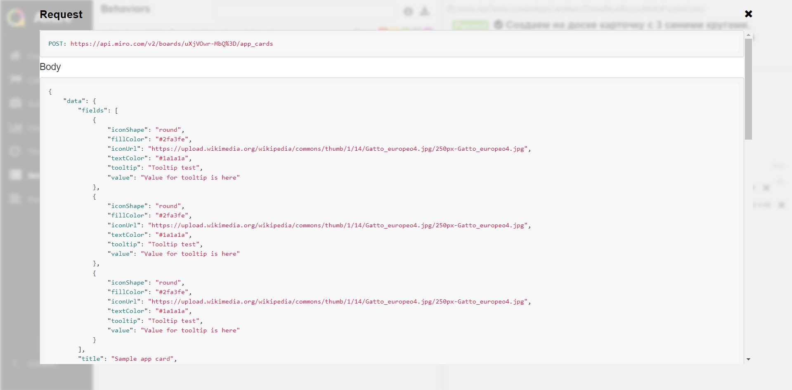
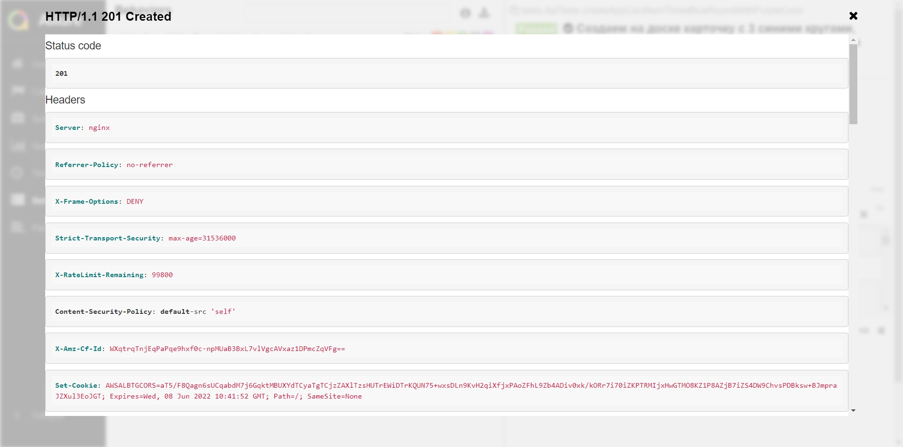
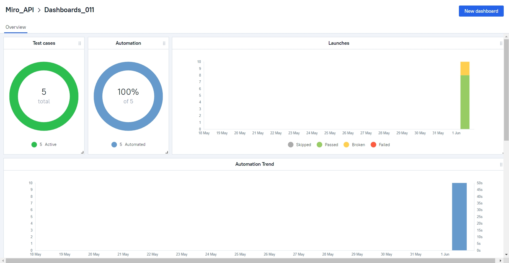
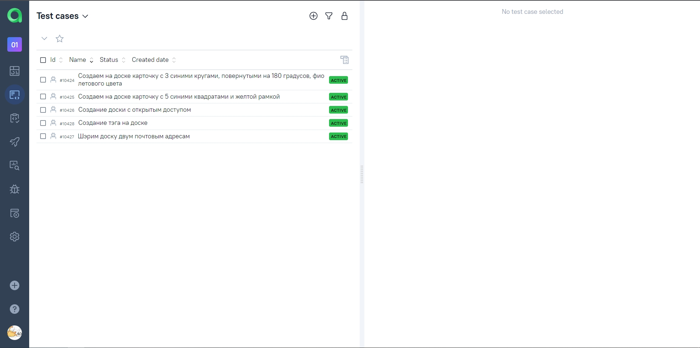
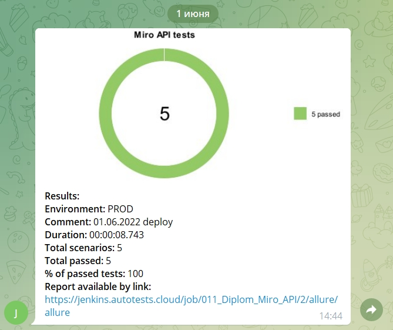

# Проект по автотестированию API [Miro](https://developers.miro.com/reference/api-reference)
[](https://miro.com/)

<a name="оглавление"></a>
# Оглавление
- [Технологии и инструменты](#computer-технологии-и-инструменты)
- [Описание проекта](Описание-проекта)
- [Сборка в Jenkins](#-сборка-в-jenkins)
- [Запуск из терминала](#computer-Запуск-тестов-из-терминала)
- [Отчет в Allure report](#-отчет-в-allure-report)
- [Отчет в Telegram](#-уведомление-в-telegram-при-помощи-бота)
- [Видео пример прохождения тестов](#-видео-пример-прохождения-теста)

## :computer: Технологии и инструменты
<p align="center">


</p>

<a name="описание"></a>
# Описание проекта
Автоматизирована проверка 4 методов API:
- /boards - создание доски с различными параметрами приватности;
- /boards/{board_id}/members - поделиться доской с выбранными пользователями;
- /boards/{board_id}/app_cards - добавить карточку на доску различной формы, цветы, содержания;
- /boards/{board_id}/tags - добавить тэги на доску различных цветов и названий.

Используются:
- модели (Lombok),
- спецификации (RequestSpecification),
- генерация тестовых данных (Faker),
- конфигурации (Owner),
- проверки (AssertJ),
- шаблоны логирования запросов (AllureRestAssured FILTERS),
- схемы проверки JSON Schema Validator.

## Тест кейсы
>- [x] Создание на доске карточки с 3 синими кругами, повернутыми на 180 градусов, фиолетового цвета
>- [x] Создание на доске карточки с 5 синими квадратами и желтой рамкой
>- [x] Создание доски с открытым доступом
>- [x] Расшарить доску двум почтовым адресам
>- [x] Создание тэга на доске

## [Сборка в Jenkins](https://jenkins.autotests.cloud/job/011_Diplom_Miro_API/)

Локальный запуск осуществляется командой:
```
gradle clean test -Dthreads=4
```
Где `threads` - количество потоков параллельного запуска тестов.

Остальные 2 параметра `token` и `testBoardId` указываются в файле .properties, пример лежит в папке **resources**.


В поле коммент можно ввести уточняющие данные, которые затем отобразятся в отчете, например дату запуска.

## Информация о тестах в [Allure report](https://jenkins.autotests.cloud/job/011_Diplom_Miro_API/allure/)

### Главное окно


_Дашбоард_

### Окно с тест-кейсами



### Окно с вложениями


_Пример вложения запроса_


_Пример вложения ответа_


## Интеграция с [AllureTestOps](https://allure.autotests.cloud/project/1365/dashboards)

### Дашборд проекта



### Список автотестов


## Уведомления в Telegram

После завершения тестов отчет о прохождении приходит в Telegram с помощью заранее созданного бота

### Для web тестов
